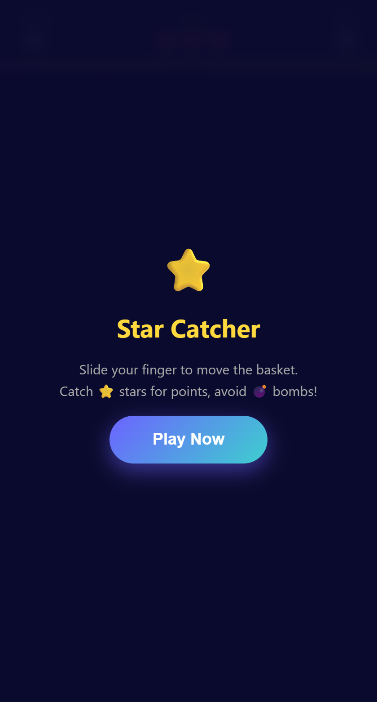
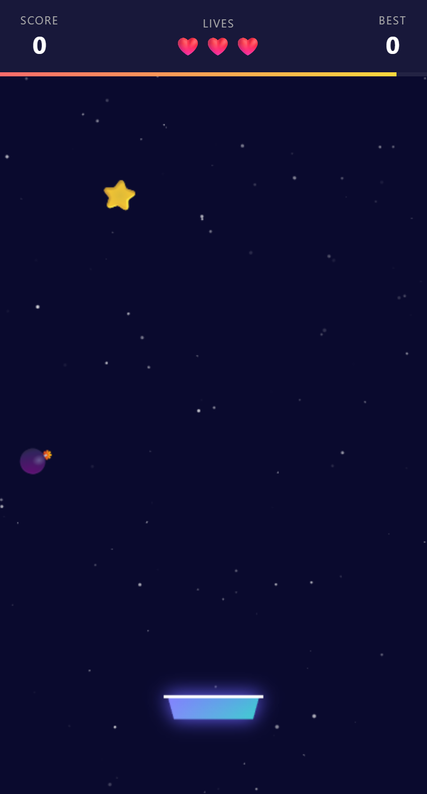

<div align="center">

# ⭐ Star Catcher

### A browser-based casual arcade game — catch stars, dodge bombs, chase high scores!

[](https://developer.mozilla.org/en-US/docs/Web/HTML)
[](https://developer.mozilla.org/en-US/docs/Web/JavaScript)
[](https://developer.mozilla.org/en-US/docs/Web/API/Canvas_API)
[](https://github.com/ingamesable-svg/my-first-game)
[](LICENSE)

<br/>


&nbsp;&nbsp;&nbsp;&nbsp;


<br/><br/>

*Left: Start screen · Right: Live gameplay with the glowing basket, falling stars and a bomb*

</div>

---

## 📖 Table of Contents

- [About the Game](#-about-the-game)
- [Screenshots](#-screenshots)
- [How to Play](#-how-to-play)
- [Game Mechanics](#-game-mechanics)
  - [Scoring System](#scoring-system)
  - [Combo Multiplier](#combo-multiplier)
  - [Lives System](#lives-system)
  - [Progressive Difficulty](#progressive-difficulty)
- [Features](#-features)
- [Tech Stack](#-tech-stack)
- [Project Structure](#-project-structure)
- [Architecture Deep Dive](#-architecture-deep-dive)
  - [Game Loop](#game-loop)
  - [Particle System](#particle-system)
  - [Input Handling](#input-handling)
  - [Config System](#config-system)
- [Getting Started](#-getting-started)
- [Game Balance & Tuning](#-game-balance--tuning)
- [Browser Compatibility](#-browser-compatibility)
- [Contributing](#-contributing)
- [License](#-license)

---

## 🎮 About the Game

**Star Catcher** is a fast-paced, browser-based casual arcade game built entirely from scratch using **vanilla HTML5, CSS3, and JavaScript** — no frameworks, no libraries, no build tools required.

You control a glowing basket at the bottom of a star-filled night sky. Stars and golden stars rain down from above — catch as many as you can before they hit the ground. But watch out: bombs are mixed in, and catching one (or missing too many stars) will cost you a precious life.

The game progressively speeds up over time, pushing your reaction speed to the limit. Chain catches together for massive **combo multipliers**, climb the score ladder, and beat your personal best. It's simple, satisfying, and endlessly replayable.

> **🚀 Instant play — just open the HTML file in any browser. No installation, no server, no setup.**

---

## 📸 Screenshots

<div align="center">

### Start Screen


*The title screen with its deep-space dark blue backdrop, glowing title and the "Play Now" CTA button.*

<br/>

### Gameplay


*Active gameplay: the HUD shows Score / Lives / Best at the top, a gradient progress bar ticks underneath, stars and a bomb fall through the twinkling background, and the glowing gradient basket waits at the bottom.*

</div>

---

## 🕹️ How to Play

### Desktop
| Action | Control |
|--------|---------|
| Move basket left / right | Move your **mouse** horizontally across the screen |
| Start / Restart game | Click the **Play Now** or **Play Again** button |

### Mobile / Tablet
| Action | Control |
|--------|---------|
| Move basket left / right | **Slide your finger** across the screen |
| Start / Restart game | Tap the **Play Now** or **Play Again** button |

### Objective

1. **Catch** ⭐ stars and 🌟 golden stars to earn points.
2. **Avoid** 💣 bombs — catching one costs a life.
3. **Don't miss** regular stars — each missed star also costs a life.
4. **Chain catches** within 1.8 seconds to build a combo multiplier and multiply your points.
5. Survive as long as possible. The game ends when all **3 lives** are gone.
6. Beat your **personal best** score, which is saved automatically between sessions.

---

## ⚙️ Game Mechanics

### Scoring System

Every item that falls has a base point value:

| Item | Emoji | Points | Spawn Probability |
|------|-------|--------|-------------------|
| Regular Star | ⭐ | 10 pts | ~75% |
| Golden Star | 🌟 | 30 pts | ~7% |
| Bomb | 💣 | —1 life | ~18% |

> Golden stars are rarer and worth **3× more** than regular stars — prioritise them when safe to do so!

### Combo Multiplier

The combo system rewards fast, consecutive catches:

```
Catch within 1.8 s of the previous catch → combo counter increases
Combo ≥ 3       → multiplier = combo count × base points
Combo < 3       → normal points (×1)
Missing a catch → combo resets on the next item
```

**Example:** catch 5 stars in a row within the 1.8-second window:
- Stars 1–2: ×1 each = 10 pts each
- Star 3: ×3 = 30 pts
- Star 4: ×4 = 40 pts
- Star 5: ×5 = 50 pts

A **🔥 xN COMBO!** flash animates on screen whenever you hit or extend a combo streak.

### Lives System

You start each round with **3 lives** (❤️❤️❤️).

You lose a life when:
- 💣 A bomb lands in your basket
- ⭐ / 🌟 A star or golden star falls off the bottom of the screen uncaught

The HUD tracks your remaining lives in real time, updating hearts (❤️ → 🖤) as you lose them. When all lives are gone, the **Game Over** screen appears with your final score and personal best.

### Progressive Difficulty

The game automatically ramps up challenge over time:

| Parameter | Change | Interval |
|-----------|--------|----------|
| Fall speed | ×1.12 (12% faster) | Every 8 seconds |
| Spawn interval | ×0.92 (8% more frequent) | Every 8 seconds |
| Minimum spawn interval | **600 ms** (hard cap) | — |

This means that as the game goes on, more items fall faster and more frequently, demanding sharper reflexes and broader basket positioning.

---

## ✨ Features

- 🌌 **Animated starfield background** — 120 individual background stars with smooth random twinkling
- 🧺 **Glowing gradient basket** — purple-to-teal gradient with a neon purple glow effect
- 💥 **Particle burst system** — coloured explosion particles for every catch and miss event
- 🔢 **Floating score popups** — point values float and fade upward from the catch location
- 🔥 **Combo flash animation** — large, glowing combo text flies onto screen when streak hits ×3+
- ❤️ **Live hearts HUD** — hearts visually drain to black skulls as lives are lost
- 🔴 **Screen flash on hit** — brief red screen overlay for immediate visual feedback on life loss
- 📊 **Progress timer bar** — a red→yellow gradient bar depletes on a 30-second visual cycle
- 💾 **Persistent best score** — saved to `localStorage` and shown on both the HUD and Game Over screen
- 📱 **Fully responsive** — canvas resizes to any screen size, from phones to widescreen monitors
- 🖱️ **Cross-platform input** — mouse on desktop, touch on mobile/tablet, both with boundary clamping
- ⏱️ **Delta-time physics** — frame-rate-independent movement, smooth on any device
- ⚡ **Progressive speed scaling** — gameplay accelerates every 8 seconds, keeping the challenge fresh
- 🎮 **Zero-dependency** — one HTML file, runs offline, no internet connection required after download

---

## 🛠️ Tech Stack

| Technology | Usage |
|------------|-------|
| **HTML5** | Semantic page structure, HUD, overlays, canvas element |
| **CSS3** | Flexbox layout, backdrop-filter blur, gradient buttons, animations |
| **JavaScript ES6+** | All game logic — no transpilation needed |
| **Canvas 2D API** | Rendering basket, falling items, particles, background stars |
| **Web Animations** | CSS transitions for combo flash, timer bar, button press effect |
| **localStorage API** | Persisting the player's best score between sessions |
| **Touch Events API** | Mobile/tablet drag-to-move basket input |
| **Mouse Events API** | Desktop mousemove basket control |
| **requestAnimationFrame** | Smooth, battery-efficient game loop |
| **performance.now()** | High-resolution timing for delta-time and combo window |

**Total external dependencies: 0**

---

## 📁 Project Structure

```
star-catcher/
│
├── star-catcher.html          # The entire game — HTML + CSS + JS in one file
├── screenshot.png             # Start screen screenshot
├── screenshot-gameplay.png    # Gameplay screenshot
└── README.md                  # This file
```

The game intentionally uses a **single-file architecture** for maximum portability. You can copy `star-catcher.html` to any machine, USB drive, or web server and it will run perfectly without any supporting files.

---

## 🔬 Architecture Deep Dive

### Game Loop

The game uses a standard **`requestAnimationFrame`** loop with **delta-time** to decouple physics from frame rate:

```javascript
function gameLoop(ts) {
  const dt = Math.min(ts - lastTime, 50); // cap at 50ms to handle tab focus pauses
  lastTime = ts;

  // Speed-up logic every CFG.speedupInterval seconds
  if (speedTimer >= CFG.speedupInterval * 1000) {
    fallSpeed  *= CFG.speedupFactor;
    spawnInterval = Math.max(600, spawnInterval * 0.92);
  }

  // Spawn → Update → Draw pipeline
  spawnItem();
  updateItems(dt);
  updateParticles();
  drawStars();
  drawItems();
  drawBasket();
  drawParticles();

  animId = requestAnimationFrame(gameLoop);
}
```

The `dt` cap at **50 ms** prevents items from teleporting after the user switches tabs or the browser throttles the loop.

### Particle System

Particles are plain JavaScript objects stored in an array. Each frame:
1. Position is updated with velocity + gravity (`vy += 0.15`)
2. Alpha fades at a constant rate (`alpha -= 0.035`)
3. Dead particles (alpha ≤ 0) are spliced out

Score popups follow the same pattern, rising upward (`vy = -1.8`) and fading more slowly (`alpha -= 0.025`), giving the player time to read the value.

```
spawnParticles(x, y, color, count)  →  burst of coloured dots
spawnScorePopup(x, y, text)         →  floating "+30" style label
```

### Input Handling

Both touch and mouse inputs set `basketX` directly, then clamp it to keep the basket fully on screen:

```javascript
function clampBasket() {
  const hw = CFG.basketW / 2 + 4;
  basketX = Math.max(hw, Math.min(canvas.width - hw, basketX));
}
```

Touch events use `{ passive: false }` on `touchmove` (to call `preventDefault()` and suppress page scroll during gameplay) and `{ passive: true }` on `touchstart` (no scroll prevention needed).

### Config System

All tweakable game-balance values live in a single `CFG` object at the top of the script, making tuning effortless:

```javascript
const CFG = {
  basketW: 90,           // basket width in pixels
  basketH: 22,           // basket height in pixels
  basketY: 0.88,         // vertical position as fraction of canvas height
  fallSpeed: 2.8,        // initial fall speed (pixels/frame at 60fps)
  spawnRate: 1400,       // milliseconds between item spawns
  bombChance: 0.18,      // 18% chance an item is a bomb
  goldenChance: 0.07,    // 7% chance an item is a golden star
  lives: 3,              // starting lives
  canvasColor: '#0a0a2e',// deep-space background colour
  speedupInterval: 8,    // seconds between speed boosts
  speedupFactor: 1.12,   // speed multiplier per boost
};
```

---

## 🚀 Getting Started

### Option 1 — Open locally (simplest)

```bash
# Clone the repository
git clone https://github.com/ingamesable-svg/my-first-game.git
cd my-first-game

# Open the game (Windows)
start star-catcher.html

# Open the game (macOS)
open star-catcher.html

# Open the game (Linux)
xdg-open star-catcher.html
```

### Option 2 — Serve over a local HTTP server

If your browser blocks `file://` protocols for any reason:

```bash
# Using Python 3
python -m http.server 8080
# Then visit: http://localhost:8080/star-catcher.html

# Using Node.js (npx)
npx serve .
# Then visit: http://localhost:3000/star-catcher.html
```

### Option 3 — Deploy to GitHub Pages

1. Push the repository to GitHub (already done ✅)
2. Go to **Settings → Pages**
3. Set source branch to `main`, folder to `/ (root)`
4. Visit `https://ingamesable-svg.github.io/my-first-game/star-catcher.html`

---

## 🎛️ Game Balance & Tuning

Want to make the game easier or harder? Edit the `CFG` object at the top of `star-catcher.html`:

| Parameter | Default | Effect of Increasing | Effect of Decreasing |
|-----------|---------|----------------------|----------------------|
| `fallSpeed` | `2.8` | Items fall faster from the start | Items fall slower — easier early game |
| `spawnRate` | `1400 ms` | Fewer items at once | More items — harder |
| `bombChance` | `0.18` | More bombs — much harder | Fewer bombs — more forgiving |
| `goldenChance` | `0.07` | More golden stars — higher scores | Rarer golden stars — lower scores |
| `speedupInterval` | `8 s` | Slower difficulty ramp | Faster difficulty ramp |
| `speedupFactor` | `1.12` | Smaller speed jump per boost | Larger speed jump per boost |
| `lives` | `3` | More lives — more forgiving | Fewer lives — brutal |
| `basketW` | `90 px` | Wider basket — easier | Narrower basket — harder |

---

## 🌐 Browser Compatibility

| Browser | Status |
|---------|--------|
| Chrome 80+ | ✅ Full support |
| Firefox 75+ | ✅ Full support |
| Safari 13.1+ | ✅ Full support |
| Edge 80+ | ✅ Full support |
| Opera 67+ | ✅ Full support |
| Samsung Internet 12+ | ✅ Full support (touch) |
| iOS Safari 13.4+ | ✅ Full support (touch) |

**Requirements:** Any modern browser with Canvas 2D API, `requestAnimationFrame`, `localStorage`, and `performance.now()` support (all browsers since ~2015).

---

## 🤝 Contributing

Contributions, bug reports, and feature suggestions are welcome!

1. **Fork** the repository
2. **Create** a feature branch: `git checkout -b feature/awesome-feature`
3. **Commit** your changes: `git commit -m 'Add awesome feature'`
4. **Push** to the branch: `git push origin feature/awesome-feature`
5. **Open** a Pull Request

### Ideas for Contribution

- 🎵 Background music and sound effects
- 🏆 High-score leaderboard (using a backend or Firebase)
- 🎨 Alternate themes / colour schemes
- 💎 New item types (e.g., speed boost, shield, score doubler)
- 📊 Stats screen (items caught, accuracy %, longest combo)
- 🌍 Localisation / multi-language support
- ♿ Accessibility improvements (keyboard controls, high-contrast mode)
- 📱 PWA support (installable as a home screen app)

---

## 📄 License

This project is licensed under the **MIT License** — you are free to use, modify, and distribute it for any purpose.

---

<div align="center">

Made with ❤️ and vanilla JavaScript · No frameworks were harmed in the making of this game

⭐ **If you enjoyed the game, give this repo a star!** ⭐

</div>
